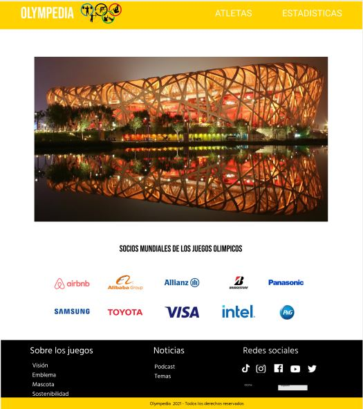
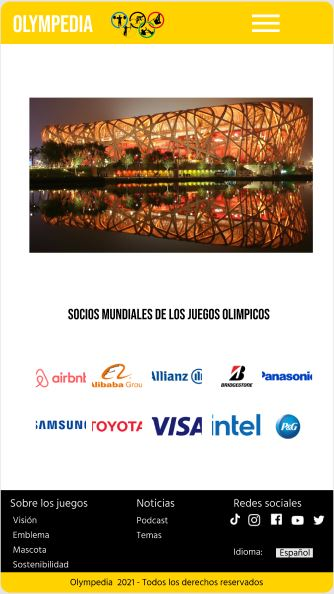
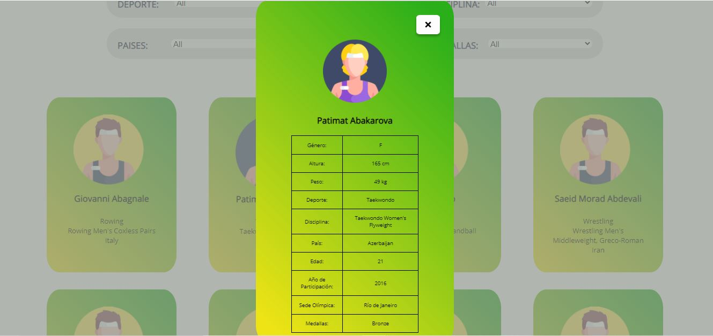
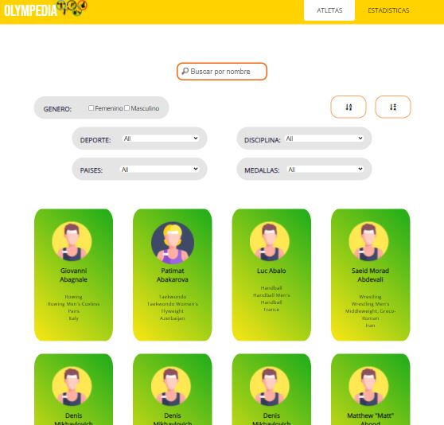
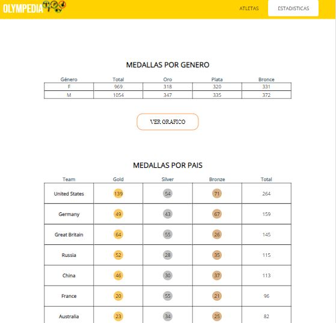

# OLYMPEDIA

## Índice

* [1. Preámbulo](#1-preámbulo)
* [2. Resumen del proyecto](#2-resumen-del-proyecto)
* [3. Objetivos de aprendizaje](#3-objetivos-de-aprendizaje)
* [4. Consideraciones generales](#4-consideraciones-generales)
* [5. Historias de usuario](#5-historias-de-usuario)
* [6. Hacker edition](#6-hacker-edition)
* [7. Consideraciones técnicas](#7-consideraciones-técnicas)
* [8. Pistas, tips y lecturas complementarias](#8-pistas-tips-y-lecturas-complementarias)
* [9. Checklist](#9-checklist)

***

## 5. Historias de usuario
##### HISTORIA N°1:
Yo como aficionado al deporte quiero visualizar una pagina web responsive y poder seleccionar si deseo ver a los atletas o las estadísticas.

##### Criterios de aceptación:
- Crear la primera página.
- Desarrollo del HTML, CSS responsivo.
- Se podrá visualizar y seleccionar en la barra de navegación a los atletas o las estadísticas de los juegos olímpicos.

##### Definición de terminado:
- Ya sea si se ingrese desde una computadora, laptop, Tablet o celular el usuario podrá visualizar la pagina web de manera responsive.
- El usuario podrá desplazarse para que vea a los atletas o las estadísticas sobre los ganadores de las medallas.

##### HISTORIA N°2:
Yo como aficionado al deporte quiero poder visualizar a los atletas y poder ver todos sus datos, así como también poder buscarlos por su nombre.

##### Criterios de aceptación:
- Visualizar la lista de atletas en tarjetas.
- Visualizar la información de los atletas en modales.
- Crear el buscador.
- Al escribir en el buscador el nombre de cualquier atleta todas las coincidencias con el nombre aparecen en la pantalla.

##### Definición de terminado:
- Al ingresar a la página el usuario podrá ver a todos los atletas en tarjetas junto con su avatar, al presionar en cualquier tarjeta de los jugadores, se abrirá un modal con toda su información.
- Al empezar a escribir en el buscador por nombres se empezarán a quedar solo los atletas en los que en su nombre haya alguna coincidencia con los que se está escribiendo.

##### HISTORIA N°3:
Yo como aficionado al deporte quiero poder ordenar a los atletas por nombre ya sea de forma ascendente o descendente.

##### Criterios de aceptación:
- Crear los botones para poder ordenar.
- Buena funcionalidad al ordenar.
- Visualizar a los atletas ordenados ya sea desde la A-Z o viceversa.

##### Definición de terminado:
- Al ingresar a la pagina y presionar en cualquiera de los botones de ordenar, ascendente o descendente los atletas se ponen en ese orden.

##### HISTORIA N°4:
Yo como aficionado al deporte quiero poder filtrar a los atletas ya sea por género, disciplina, países o medallas.

##### Criterios de aceptación:
- Crear los filtros para que el usuario pueda filtrar.
- Correcta funcionalidad de los filtros.

##### Definición de terminado:
- El usuario al querer filtrar por género, deporte, disciplina, países o medallas presiona en cualquier filtro y puede seleccionar entre las opciones.
- El usuario puede ver el resultado del filtrado en la pantalla.

##### HISTORIA N°5:
Yo como aficionado al deporte quiero poder ver las estadísticas de los juegos.

##### Criterios de aceptación:
- Crear tablas con el resultado de las estadísticas de la cantidad de medallas por genero que han recibido los atletas.
- Crear tablas con el resultado de las estadísticas de la cantidad de medallas por países.
- Crear gráficos en los que se puedan apreciar mejor los resultados.

##### Definición de terminado:
- El usuario puede ver en la tercera pantalla las tablas con la información requerida, puede presionar un botón para poder ver los gráficos, lo que se abrirán en un modal.

